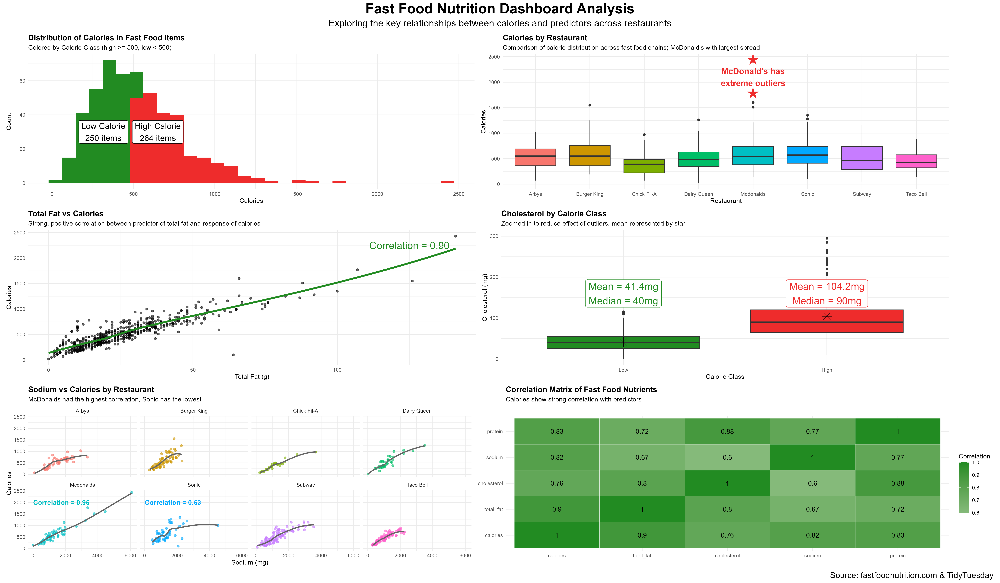
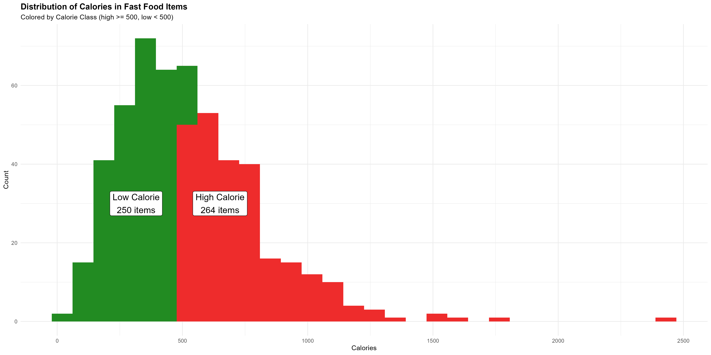
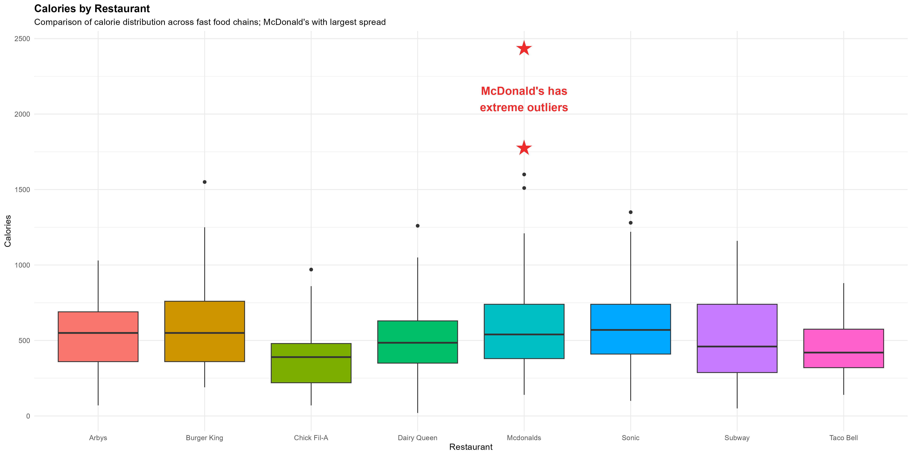
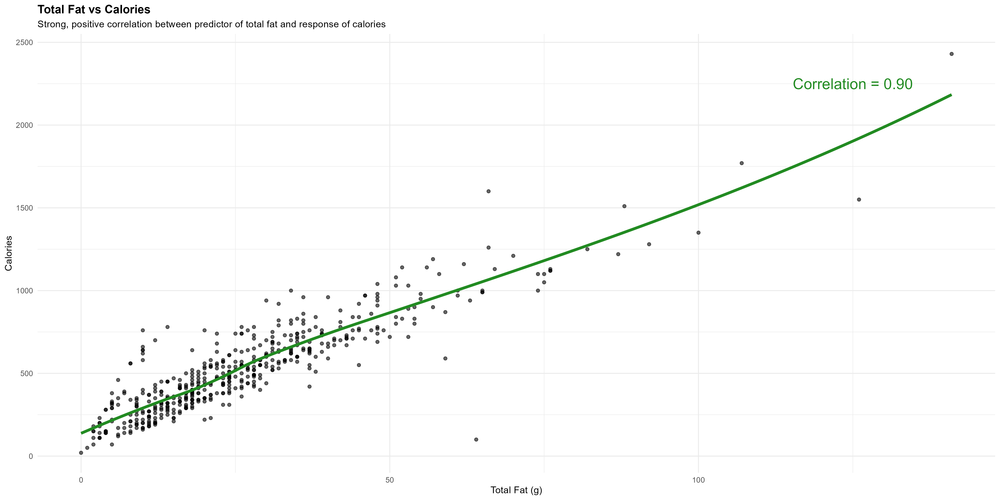
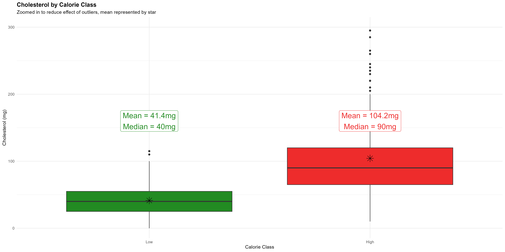
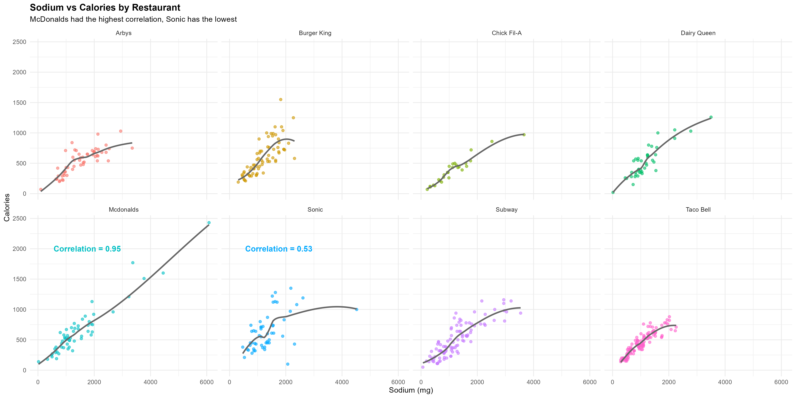
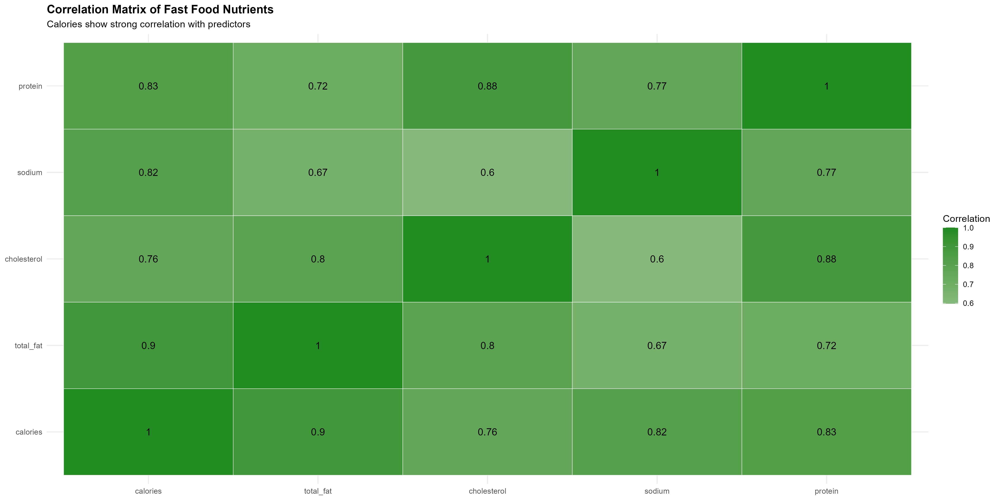
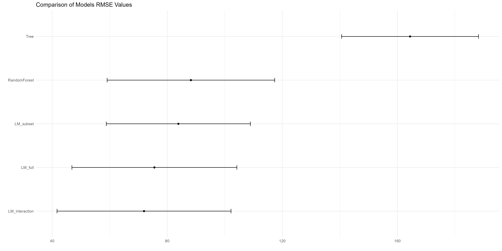
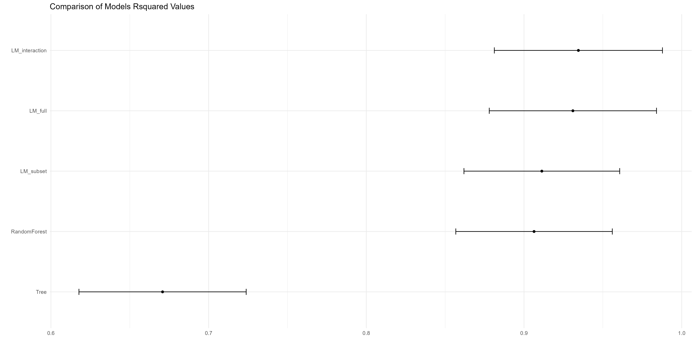

# README
# Fast Food Nutrition Project
# STA 309 Final

## Overview: 
This project analyzes fast food menu items to understand how nutritional content
relates to calorie levels. Multiple predictive models were used to determine the 
best approach using variables total_fat, cholesterol, sodium, protein, and 
restaurant. I created a classification variable that grouped items with greater
than or equal to 500 calories into the "High" calorie class and less than 500
into the "Low" calorie class. 

The goal of this is to create a meaningful dashboard that analyzes the relationships
and identify the best predictive model for calorie estimation. 

## Data Sources
All data used in this project comes from fastfoodnutrition.com and the dataset
from TidyTuesday. 

Variables include:
- Calories
- Total fat
- Cholesterol
- Sodium
- Protein
- Restaurant
- Calorie class (high vs low)

## Visualizations

### Full Dashboard

This combined dashboard brings together all the visualizations I created into one 
view. It summarizes the relationship between nutritional variables and calorie content. 

### 1. Calorie Distribution

This histogram shows the overall distribution of calories across all fast food items.
I separated them into high (500+) and low (>500) calorie classes. The distribution
is right-skewed due to the high calorie outliers. The number of high and low 
calorie items are similar but there are more high outliers. 

### 2. Calories by Restaurant

This boxplot compares calorie distributions across different fast food restaurants. 
Most restaurants show similar distributions but McDonald's has a wider spread due
to it's extreme outliers. 

### 3. Total Fat vs Calories

This scatterplot shows a strong positive relationship between total fat and calories. 
As total fat increases, calorie content does as well with a correlation of about 0.90.
This indicated that total fat is a strong predictor in the dataset. 

### 4. Cholesterol by Calorie Class

This boxplot compares cholesterol levels between low and high calorie food items. 
High calorie items have significantly higher cholesterol levels on average. The mean 
and median cholesterol values are much higher in the high calorie group which shows 
strong relationship between cholesterol and calorie classification. 

### 5. Sodium vs Calories (by restaurant)

This faceted scatterplot shows the relationship between sodium and calories
across different fast food chains. McDonald's sows the strongest correlation, 
while Sonic shows the weakest. Overall, sodium is positively related to calorie 
content, but it varies by restaurant. 

### 6. Correlation Matrix

This heatmap shows correlation between calories and the rest of the nutritional 
predictors included. Calories are strongly correlated with total fat, sodium, 
cholesterol, and protein. Additionally, there are strong correlations between
the predictors themselves which suggests multicollinearity. 

## Predictive Modeling

This section compares five predictive models used to estimate calorie content. 
All models were evaluated with 5-fold cross-validation and compared using RMSE
and R-squared.

### Model 1: Full Linear Regression
This model used all predictors (total fat, cholesterol, sodium, protein, and restaurant type) 
to predict calories. It is a baseline model for the rest

### Model 2: Subset Linear Regression
This model uses a reduced set of predictors (total fat, sodium, and protein) to test
whether a simpler model can maintain accuracy. It does perform well, but not as good
as the full model does. 

### Model 3: Regression Tree
This decision tree model captures the relationships by splitting the data. However, 
it is the worst among all models because it does not generalize well for predicting 
calorie content. 

### Model 4: Random Forest
This model builds multiple decision tress and averages their predictions to improve
accuracy. It performs well but not as well as the linear models. 

### Model 5: Interaction Linear Regression
This model includes interaction terms between total fat and sodium. This performs
the best overall with the lowest RMSE and highest R-squared. This shows that 
the relationships between the predictors are not purely independent and the interaction
improved the predictive accuracy. 

Below are the visualizations I used to compare the values for each model. 

## Model Summary
- Best Model: Interaction Linear Regression
- Worst Model: Regression Tree

## Key Findings
- Calories are strongly driven by fat, sodium, and protein
- McDonald's shows greatest variability in calorie content
- Nutrients are highly correlated with each other
- Linear relationships are influential in dataset
- Interaction effects improve predictive accuracy

This analysis shows that calorie content in fast food can be predicted using
nutritional variables. Simple linear models with interaction terms perform the best
but there could be a better model out there. 

Limitations of this analysis include potential multicollinearity among predictors.
Also, there weren't large improvements compared to the full linear model which suggests
that the added complexity of interaction effects doesn't do much in return. Alternative
evaluation metrics like MAE could have provided additional insight into the errors. 

## Repository Contents 
- `dashboard.png` — Full visualization dashboard  
- `calorie_distribution.png` — Calorie histogram  
- `calorie_restaurant.png` — Calories by restaurant  
- `totalfat_calories.png` — Fat vs calories  
- `cholesterol_calories.png` — Cholesterol by class  
- `sodium_calories.png` — Sodium vs calories  
- `correlation_matrix.png` — Correlation heatmap  
- `rmse_plot.png` — Model RMSE comparison  
- `rsquared_plot.png` — Model R² comparison  
- `Final_Exam_STA_309_Isabelle_Hennessy.Rmd` — Full code  
- `Final_Exam_STA_309_Isabelle_Hennessy.html` - Knitted HTML version of full report
- `README.txt` — Project report  
